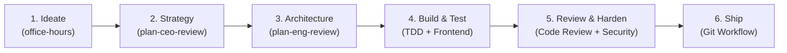

# AI Agent Skills & Tooling Guide

This workspace is equipped with a full suite of production-grade engineering skills, strategic founder workflows from [gstack](https://github.com/garrytan/gstack), and access to 100+ community skills via the Model Context Protocol (MCP).

---

## ⚡ The Full-Lifecycle Sprint Workflow

You can run these skills in sequence to move from initial idea to production:

---

## 🛠️ Installed Skills Directory

### 1. Product Strategy & Planning ([gstack](https://github.com/garrytan/gstack))

| Skill | What It Does | Example Prompts |
| :--- | :--- | :--- |
| [**`office-hours`**](file:///d:/NANI/.agents/skills/office-hours/SKILL.md) | **YC Office Hours** — Interrogates product demand with 6 forcing questions (customer pain, status quo, narrowest wedge) and generates a `DESIGN.md`. | • *"Run office hours on an idea for..."* • *"Help me think through this product concept"* • *"Is this feature worth building?"* |
| [**`plan-ceo-review`**](file:///d:/NANI/.agents/skills/plan-ceo-review/SKILL.md) | **CEO / Founder Mode** — Challenges scope, finds the "10-star product", and evaluates plans under 4 postures (Expand, Selective, Hold, or Cut). | • *"Do a plan CEO review on this proposal"* • *"Think bigger on this feature"* • *"Review this plan in founder mode"* |
| [**`plan-eng-review`**](file:///d:/NANI/.agents/skills/plan-eng-review/SKILL.md) | **Engineering Manager** — Locks in architecture, generates ASCII/Mermaid data-flow diagrams, maps failure paths, and builds test matrices. | • *"Run an engineering plan review"* • *"Review the architecture and failure paths"* • *"Lock in the plan before writing code"* |
| [**`planning-and-task-breakdown`**](file:///d:/NANI/.agents/skills/planning-and-task-breakdown/SKILL.md) | **Task Decomposition** — Breaks complex specs into ordered, dependency-aware milestone checklists. | • *"Break this task into implementation steps"* • *"Create an ordered execution plan"* |

---

### 2. Core Engineering & Quality ([Addy Osmani](https://github.com/addyosmani/agent-skills))

| Skill | What It Does | Example Prompts |
| :--- | :--- | :--- |
| [**`test-driven-development`**](file:///d:/NANI/.agents/skills/test-driven-development/SKILL.md) | **TDD Workflow** — Drives implementation through strict Red-Green-Refactor cycles and high-coverage test suites. | • *"Use TDD to implement this function"* • *"Write failing unit tests first, then implement"* |
| [**`code-review-and-quality`**](file:///d:/NANI/.agents/skills/code-review-and-quality/SKILL.md) | **Staff Code Review** — Catches bugs, architectural drift, anti-patterns, and completeness gaps before merging. | • *"Review my code changes for defects"* • *"Run a quality and architecture audit on this PR"* |
| [**`debugging-and-error-recovery`**](file:///d:/NANI/.agents/skills/debugging-and-error-recovery/SKILL.md) | **Root Cause Analysis** — Applies the *Iron Law: no fixes without investigation*. Isolates reproduction steps and prevents regressions. | • *"Investigate why this test is failing"* • *"Systematically debug this crash log"* |
| [**`security-and-hardening`**](file:///d:/NANI/.agents/skills/security-and-hardening/SKILL.md) | **Security Audit** — Audits against OWASP Top 10 vulnerabilities, sanitizes untrusted inputs, and hardens dependencies. | • *"Audit this endpoint for security risks"* • *"Harden authentication and input validation"* |
| [**`performance-optimization`**](file:///d:/NANI/.agents/skills/performance-optimization/SKILL.md) | **Performance Profiling** — Identifies CPU/memory bottlenecks, optimizes Core Web Vitals, and minimizes database query overhead. | • *"Profile and optimize load performance"* • *"Find bottlenecks in this query pipeline"* |
| [**`api-and-interface-design`**](file:///d:/NANI/.agents/skills/api-and-interface-design/SKILL.md) | **API Design** — Creates clean, type-safe REST, RPC, and SDK interface contracts with explicit error typing. | • *"Design a clean REST/GraphQL API for..."* • *"Define the interface contracts between client and server"* |
| [**`git-workflow-and-versioning`**](file:///d:/NANI/.agents/skills/git-workflow-and-versioning/SKILL.md) | **Git Standards** — Generates conventional commits, structured PR descriptions, and semantic version bumps. | • *"Prepare an atomic commit and PR description"* • *"Review git branch and tag a release"* |

---

### 3. Frontend & Agent Extensibility ([Anthropic](https://github.com/anthropics/skills))

| Skill | What It Does | Example Prompts |
| :--- | :--- | :--- |
| [**`mcp-builder`**](file:///d:/NANI/.agents/skills/mcp-builder/SKILL.md) | **MCP Server Development** — Guide & templates for building, testing, and evaluating high-quality Model Context Protocol (MCP) servers (Python/FastMCP or TypeScript). | • *"Build an MCP server for [API]"* • *"Create an MCP tool with schema validation"* |
| [**`skill-creator`**](file:///d:/NANI/.agents/skills/skill-creator/SKILL.md) | **Skill Authoring** — Complete workflow for authoring, grading, and refining custom agent skills (`SKILL.md`). | • *"Create a custom agent skill for [Workflow]"* • *"Evaluate and package this skill"* |
| [**`frontend-design`**](file:///d:/NANI/.agents/skills/frontend-design/SKILL.md) | **Design Systems & UI** — Creates interfaces with curated color palettes, modern typography, responsive layouts, and motion design (no generic AI templates). | • *"Design a landing page / dashboard"* • *"Refactor this UI to look premium and distinct"* |
| [**`webapp-testing`**](file:///d:/NANI/.agents/skills/webapp-testing/SKILL.md) | **Browser Testing** — End-to-end web testing with Playwright, verifying DOM interactions, console errors, and screenshots. | • *"Write end-to-end tests for the checkout flow"* • *"Verify this web app using Playwright"* |
| [**`web-artifacts-builder`**](file:///d:/NANI/.agents/skills/web-artifacts-builder/SKILL.md) | **Interactive Web Artifacts** — Builds multi-component, interactive web applications and dashboards. | • *"Build an interactive web simulation artifact"* |

---

## 🌐 Skills MCP Server: `awesome-agent-skills`

Your global [mcp_config.json](file:///C:/Users/Admin/.gemini/config/mcp_config.json) connects to the **Awesome Agent Skills** server, exposing 100+ community skills across top organizations (Vercel, Trail of Bits, Hugging Face, Sentry, Stripe, Expo).

### Available MCP Tools:
- `list_skills`: Browse available skills by tag (e.g. `tag: "security"` or `tag: "react"`).
- `get_skill`: Inspect the full prompt/workflow for a specific skill.
- `invoke_skill`: Run a specific community skill with parameters.
- `refresh_skills`: Sync the latest skills from GitHub.

### Example Prompts:
* *"List all security skills from the Awesome Agent Skills MCP"*
* *"Get the Next.js best practices skill from the MCP server and apply it to my routes"*
* *"Use the Stripe integration skill from MCP to review my payment flow"*

---

## 📋 Engineering Standards ([AGENTS.md](file:///d:/NANI/AGENTS.md))

All development in this repository adheres to the rules defined in [`AGENTS.md`](file:///d:/NANI/AGENTS.md):
1. **Boil the Ocean**: Complete implementations only. Never omit error paths or edge cases.
2. **The Reuse Ladder**: Repo Patterns → Standard Library → Platform Features → Dependencies.
3. **User Sovereignty**: The AI recommends; the human decides.
4. **Builder Voice**: Direct, concrete, zero corporate buzzwords.
